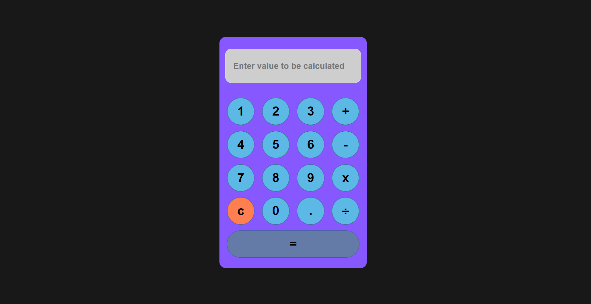

# Project Name

## Description
This project is aimed at [describe your project's main purpose or goal here].

## Features
- Feature 1: [Description of feature 1]
- Feature 2: [Description of feature 2]
- ...

## Technologies Used
- Technology 1: [Description of technology 1, e.g., JavaScript, HTML, CSS]
- Technology 2: [Description of technology 2]
- ...

## Installation
To run this project locally, follow these steps:
1. Clone the repository: `git clone https://github.com/your_username/your_project.git`
2. Change into the project directory: `cd your_project`
3. [Additional steps or dependencies needed for setup]

## Usage
[Instructions on how to use or run the project]

## Contributing
If you want to contribute to this project, follow these steps:
1. Fork the repository
2. Create a new branch: `git checkout -b feature_branch`
3. Make your changes and commit them: `git commit -m 'Description of changes'`
4. Push to the branch: `git push origin feature_branch`
5. Submit a pull request

## License
This project is licensed under the [License Name]. [Additional license details]

## Contact
For any inquiries or feedback, feel free to contact:
- [Your Name](mailto:your_email@example.com)
- [Project Website](https://your_project_website.com)
